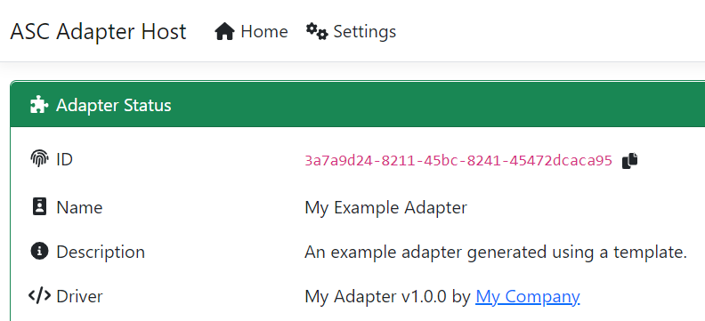
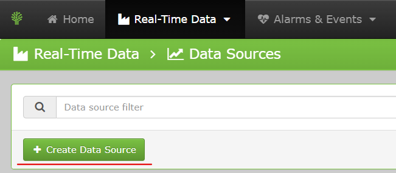
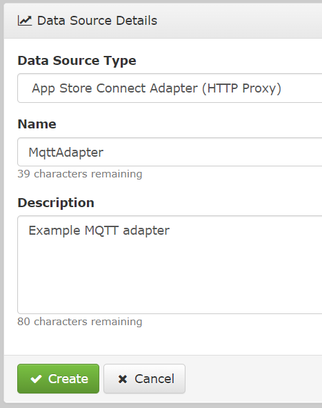
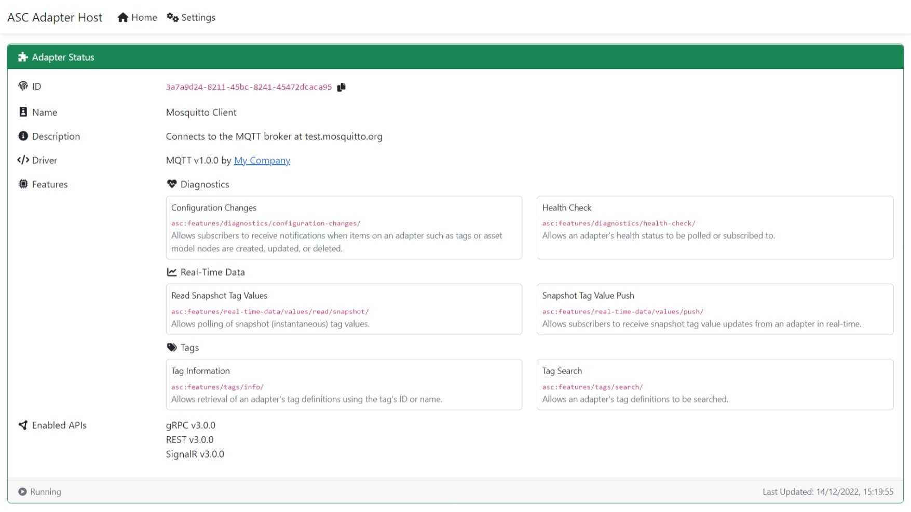
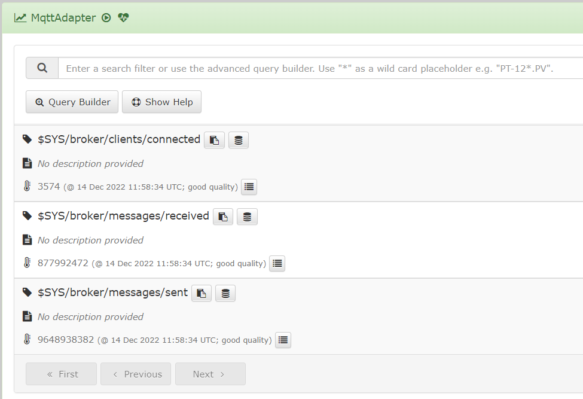
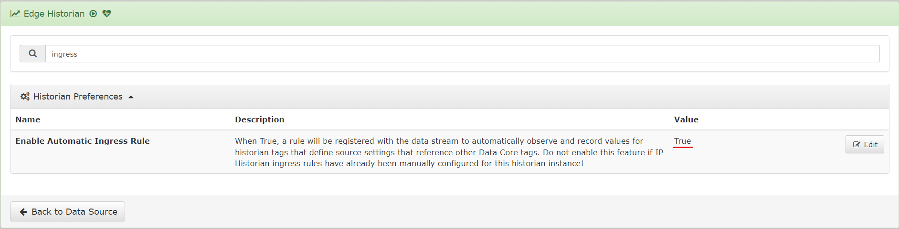
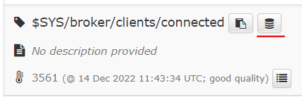
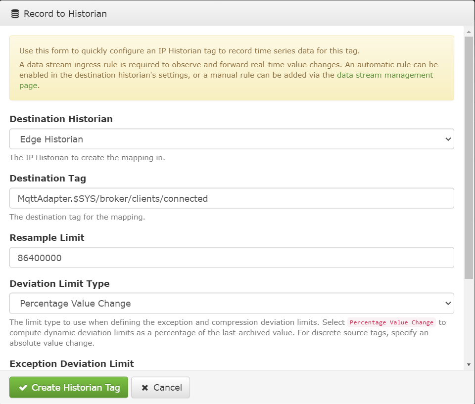
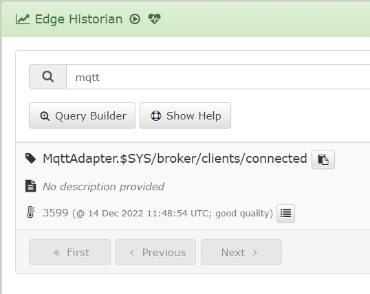

# Creating a Simple MQTT Adapter

In this tutorial, we will create a simple MQTT adapter that performs the following actions:

- Connects to the public [Mosquitto](https://mosquitto.org/) MQTT broker at `test.mosquitto.org` at startup.
- Subscribes to a configurable set of MQTT topics.
- Maintains an in-memory list of tags (one per distinct topic).
- Supports snapshot polling and subscription features.

The tutorial also explains how to connect App Store Connect to the adapter, and how to record values received from the MQTT 

> The full source code for this tutorial is available [here](../../../examples/SimpleMqttExample/).


# Pre-requisites

- Visual Studio 2022 17.4 or later with the [App Store Connect adapter project templates](/src/DataCore.Adapter.Templates) installed
- An [Industrial App Store](https://appstore.intelligentplant.com) user account
- Intelligent Plant [App Store Connect](https://appstore.intelligentplant.com/Home/AppProfile?appId=a73c453df5f447a6aa8a08d2019037a5) installed on your machine and connected to the Industrial App Store


# Getting Started

In Visual Studio, create a new project named `MqttAdapter` using the `Industrial App Store Connect Adapter Host` template by following the instructions [here](/src/DataCore.Adapter.Templates).

You can choose to target .NET 7 or .NET 6 (the latest version and current long-term support version respectively at time of writing). You can accept the default values for all other settings; they can be changed in code later if desired.


# Configure App Store Connect

Press F5 in Visual Studio to run the out-of-the-box adapter. The adapter overview page will open in your web browser:



Open the App Store Connect UI in your browser. From the "Real-Time Data > Data Sources" tab, click "Create Data Source":



Select "App Store Connect Adapter (HTTP Proxy)" as the data source type. Enter "MqttAdapter" as the data source name and "Example MQTT adapter" as the description:



Click "Create" to create the data source. You will be taken to the data source's driver settings page. Configure the following settings:

- Address: `<COPY URL FROM ADAPTER HOST HOME PAGE e.g. http://localhost:44300>`
- Adapter ID: `<COPY ID FROM ADAPTER HOST HOME PAGE>`
- Use SignalR: `True`


# Add Required Package References

Add a NuGet package reference to [MQTTnet.Extensions.ManagedClient @ v4.1.4.563](https://www.nuget.org/packages/MQTTnet.Extensions.ManagedClient/4.1.4.563) to the adapter project.


# Update the Adapter Options Class

Replace the contents of `MyAdapterOptions.cs` with the following code:

```cs
using System.ComponentModel.DataAnnotations;

using DataCore.Adapter;

#nullable disable warnings

namespace MqttAdapter {

    public class MyAdapterOptions : AdapterOptions {

        [Display(Description = "The MQTT server hostname")]
        [Required(ErrorMessage = "You must specify a hostname")]
        [MaxLength(500, ErrorMessage = "Hostname cannot be longer than 500 characters")]
        public string Hostname { get; set; }

        [Display(Description = "The port number for the MQTT server")]
        [Range(1, 65535, ErrorMessage = "Port must be in the range 1 - 65535")]
        public int Port { get; set; }

        [Display(Description = "A comma-delimited list of MQTT topics to subscribe to")]
        [Required(ErrorMessage = "You must specify a list of MQTT topics to subscribe to")]
        public string Topics { get; set; }

    }

}
```

As you can see, we are specifying the bare minimum options required to connect to an MQTT broker and subscribe to topics. If we were connecting to a broker that required authentication or TLS, we would need to add properties to the `MyAdapterOptions` class to accomodate this.


# Update the Runtime Adapter Settings

We will pre-configure the adapter to connect to `test.mosquitto.org` on port 1833 (the standard non-TLS MQTT port) and subscribe to topics that notify us about connected clients. Replace the contents of `adaptersettings.json` with the following:

```json
{
  "AppStoreConnect": {
    "Adapter": {
      "Settings": {
        "Name": "Mosquitto Client",
        "Description": "Connects to the MQTT broker at test.mosquitto.org",
        "IsEnabled": true,
        "Hostname": "test.mosquitto.org",
        "Port": 1883,
        "Topics": "$SYS/broker/clients/connected,$SYS/broker/messages/sent,$SYS/broker/messages/received"
      }
    }
  }
}
```


# Update the Adapter

Delete `MyAdapter.ReadSnapshotTagValues.cs`; we will use a helper class to implement snapshot tag value polling instead. In Visual Studio, you may need to expand `MyAdapter.cs` in the Solution Explorer to find this file!

Replace the contents of `MyAdapter.cs` with the following code:

```cs
using DataCore.Adapter;
using DataCore.Adapter.Common;
using DataCore.Adapter.Diagnostics;
using DataCore.Adapter.RealTimeData;
using DataCore.Adapter.Tags;

using IntelligentPlant.BackgroundTasks;

using Microsoft.Extensions.Options;

using MQTTnet;
using MQTTnet.Client;
using MQTTnet.Extensions.ManagedClient;
using MQTTnet.Packets;
using MQTTnet.Protocol;

namespace MqttAdapter {
    [AdapterMetadata(
        "https://my-company.com/app-store-connect/adapters/mqtt/",
        Name = "MQTT",
        Description = "Adapter for connecting to an MQTT broker",
        HelpUrl = "https://my-company.com/app-store-connect/adapters/mqtt/help"
    )]
    public partial class MyAdapter : AdapterBase<MyAdapterOptions> {

        private static readonly AdapterProperty s_tagCreatedAtPropertyDefinition = new AdapterProperty("UTC Created At", DateTime.MinValue, "The UTC creation time for the tag");

        private static readonly System.Diagnostics.Metrics.Counter<int> s_messagesReceived = Telemetry.Meter.CreateCounter<int>("mqtt.messages_received", "{messages}", "Count of messages received from the MQTT broker");

        private readonly TagManager _tagManager;

        private readonly SnapshotTagValueManager _snapshotManager;

        private readonly ConfigurationChanges _configurationChanges;

        private readonly MqttFactory _factory = new MqttFactory();

        private IManagedMqttClient? _mqttClient;

        private readonly Nito.AsyncEx.AsyncLock _mqttInitLock = new Nito.AsyncEx.AsyncLock();


        public MyAdapter(
            string id,
            IOptionsMonitor<MyAdapterOptions> options,
            IBackgroundTaskService taskScheduler,
            ILogger<MyAdapter> logger
        ) : base(id, options, taskScheduler, logger) {
            _configurationChanges = new ConfigurationChanges(new ConfigurationChangesOptions() {
                Id = id
            }, BackgroundTaskService, Logger);

            AddFeatures(_configurationChanges);

            // In both _tagManager and _snapshotManager we are passing null for the IKeyValueStore
            // parameter. This means that tag definitions and snapshot values will not be persisted
            // between restarts of the host.

            _tagManager = new TagManager(
                null,
                BackgroundTaskService,
                new[] { s_tagCreatedAtPropertyDefinition },
                _configurationChanges.NotifyAsync
            );

            AddFeatures(_tagManager);

            _snapshotManager = new SnapshotTagValueManager(new SnapshotTagValueManagerOptions() {
                Id = id,
                TagResolver = SnapshotTagValueManager.CreateTagResolverFromAdapter(this)
            }, BackgroundTaskService, null, Logger);

            AddFeatures(_snapshotManager);
        }


        protected override async Task StartAsync(CancellationToken cancellationToken) {
            await _tagManager.InitAsync(cancellationToken).ConfigureAwait(false);
            await InitMqttClientAsync(cancellationToken);
        }


        protected override async Task StopAsync(CancellationToken cancellationToken) {
            if (_mqttClient != null) {
                await _mqttClient.StopAsync().WithCancellation(cancellationToken);
            }
        }


        protected override void OnOptionsChange(MyAdapterOptions options) {
            base.OnOptionsChange(options);
            BackgroundTaskService.QueueBackgroundWorkItem(InitMqttClientAsync);
        }


        protected override async Task<IEnumerable<HealthCheckResult>> CheckHealthAsync(
            IAdapterCallContext context,
            CancellationToken cancellationToken
        ) {
            var result = new List<HealthCheckResult>();
            result.AddRange(await base.CheckHealthAsync(context, cancellationToken).ConfigureAwait(false));

            if (!IsRunning) {
                return result;
            }

            if (_mqttClient?.IsConnected ?? false) {
                result.Add(HealthCheckResult.Healthy("MQTT Server", $"Connected to {Options.Hostname}"));
            }
            else {
                result.Add(HealthCheckResult.Unhealthy("MQTT Server", "Disconnected"));
            }

            return result;
        }


        public static IEnumerable<string> GetTopics(string delimitedTopics) {
            if (string.IsNullOrWhiteSpace(delimitedTopics)) {
                yield break;
            }

            foreach (var item in delimitedTopics.Split(new[] { ',', '\n', '\r' }, StringSplitOptions.RemoveEmptyEntries | StringSplitOptions.TrimEntries)) {
                yield return item;
            }
        }


        private async Task InitMqttClientAsync(CancellationToken cancellationToken) {
            using var @lock = await _mqttInitLock.LockAsync(cancellationToken);

            _mqttClient?.Dispose();
            if (!Options.IsEnabled) {
                return;
            }

            if (_mqttClient == null) {
                Logger.LogWarning("Initialising MQTT client.");
            }
            else {
                Logger.LogWarning("Re-initialising MQTT client.");
            }

            _mqttClient = _factory.CreateManagedMqttClient();

            var mqttClientOptions = new MqttClientOptionsBuilder()
                .WithTcpServer(Options.Hostname, Options.Port)
                .Build();

            var managedMqttClientOptions = new ManagedMqttClientOptionsBuilder()
                .WithClientOptions(mqttClientOptions)
                .Build();

            _mqttClient.ConnectedAsync += OnConnectedAsync;
            _mqttClient.DisconnectedAsync += OnDisconnectedAsync;
            _mqttClient.ApplicationMessageReceivedAsync += OnMessageReceivedAsync;

            await _mqttClient.StartAsync(managedMqttClientOptions).WithCancellation(cancellationToken);

            var topics = GetTopics(Options.Topics).Select(x => new MqttTopicFilter() {
                Topic = x,
                QualityOfServiceLevel = MqttQualityOfServiceLevel.AtMostOnce
            }).ToList();

            await _mqttClient.SubscribeAsync(topics).WithCancellation(cancellationToken);
        }


        private Task OnConnectedAsync(MqttClientConnectedEventArgs args) {
            Logger.LogWarning("Connected to MQTT server.");
            OnHealthStatusChanged();
            return Task.CompletedTask;
        }


        private Task OnDisconnectedAsync(MqttClientDisconnectedEventArgs args) {
            Logger.LogWarning("Disconnected from MQTT server.");
            OnHealthStatusChanged();
            return Task.CompletedTask;
        }


        private async Task OnMessageReceivedAsync(MqttApplicationMessageReceivedEventArgs args) {
            s_messagesReceived.Add(1, new KeyValuePair<string, object?>("adapter_id", Descriptor.Id));

            var topic = args.ApplicationMessage.Topic;
            var payload = args.ApplicationMessage.ConvertPayloadToString();

            var dataValue = new TagValueBuilder()
                .WithUtcSampleTime(DateTime.UtcNow)
                .WithValue(double.TryParse(payload, out var numericValue) ? numericValue : payload)
                .Build();

            var tag = await _tagManager.GetTagAsync(topic, StopToken);
            if (tag == null) {
                tag = new TagDefinitionBuilder(topic)
                    .WithDataType(dataValue.Value.Type)
                    .WithSupportsReadSnapshotValues()
                    .WithSupportsSnapshotValuePush()
                    .WithProperty(s_tagCreatedAtPropertyDefinition.Name, dataValue.UtcSampleTime)
                    .Build();
                await _tagManager.AddOrUpdateTagAsync(tag, StopToken);
            }

            await _snapshotManager.ValueReceived(new TagValueQueryResult(tag.Id, tag.Name, dataValue), StopToken);
        }


        protected override async ValueTask DisposeAsyncCore() {
            await base.DisposeAsyncCore();
            if (_mqttClient != null) {
                await _mqttClient.StopAsync();
                _mqttClient.Dispose();
            }
        }


        protected override void Dispose(bool disposing) {
            base.Dispose(disposing);
            if (disposing) {
                _mqttClient?.Dispose();
            }
        }

    }
}
```

## Implementation Notes

### Helper Classes

The updated adapter class uses the following helper classes to implement all of the features it exposes (namely tag search, snapshot value polling and subscriptions, and notifications when new tags are created):

- [TagManager](/src/DataCore.Adapter/Tags/TagManager.cs) ([more information](../../features/tag-search.md))
- [SnapshotTagValueManager](/src/DataCore.Adapter/RealTimeData/SnapshotTagValueManager.cs) ([more information](../../features/tag-snapshot-polling-and-subscriptions.md))
- [ConfigurationChanges](/src/DataCore.Adapter/Diagnostics/ConfigurationChanges.cs)

[MQTTnet](https://github.com/dotnet/MQTTnet) is used to connect to the MQTT broker.

### MQTT Message Processing

The `InitMqttClientAsync` method connects to the MQTT broker and subscribes to the topics specified in the adapter's runtime options. This method is called when the adapter's `StartAsync` method is called, and also whenever the adapter's options are modified at runtime.

The `OnMessageReceivedAsync` method processes messages received from the MQTT broker. The message payload is initially converted to a string. If that string can be parsed to a valid `double` value, the tag value emitted for the message will be numeric; otherwise, the string value of the message is emitted.

When an MQTT message is processed, a tag definition will be created if one does not already exist for the message's topic. Tag definitions are **not** persisted between restarts of the adapter host application, since the tags will be automatically recreated at startup when messages are received from the MQTT broker. If we really wanted to persist the tag definitions (and the last-received values for each tag) we could do so by passing the `IKeyValueStore` service to the adapter's constructor and then passing the service into the constructors for the `TagManager` and `SnapshotTagValueManager` helper classes.

### Monitoring Changes to Adapter Options

The adapter constructor accepts an `IOptionsMonitor<MyAdapterOptions>` parameter. Since `IOptionsMonitor<T>` supports change notifications, this allows the adapter's settings in `adaptersettings.json` to be modified at runtime and the adapter will automatically reconfigure itself to use the updated settings. Runtime changes are handled by overriding the `OnOptionsChange` method from the `AdapterBase<TAdapterOptions>` base class.

### Telemetry

The `MyAdapter` class creates a static metric counter that is incremented every time a message is received from the MQTT broker. The counter can be observed via the [dotnet-counters](https://learn.microsoft.com/en-us/dotnet/core/diagnostics/dotnet-counters) tool (by observing the `IntelligentPlant.AppStoreConnect.Adapter:mqtt.messages_received` counter) or via the adapter host's Prometheus scraping endpoint at `/metrics`.


# Update the Adapter Options Editor Form

The `Pages/Settings.cshtml` file and its associated code-behind file contain the Razor markup and logic that is used to edit our adapter settings at runtime via the browser.

Replace the contents of `Pages/Settings.cshtml` with the following code to allow editing of the MQTT-specific properties in the `MyAdapterOptions` class:

```html
@page
@model MqttAdapter.Pages.SettingsModel
@addTagHelper *, Microsoft.AspNetCore.Mvc.TagHelpers
@{
  ViewData["Title"] = "Adapter Settings";
}

<form id="settings-form" asp-page="Settings" method="post" class="g-3">
  <div class="card">
    <div class="card-header">
      <i class="fa-solid fa-puzzle-piece fa-fw"></i>
      Adapter Settings
    </div>

    <div asp-validation-summary="ModelOnly" class="card-body text-danger"></div>

    @if (!string.IsNullOrWhiteSpace(Model.Adapter.TypeDescriptor.HelpUrl)) {
      <div class="card-body pb-0">
        <p class="small text-muted">
          Click
          <a href="@Model.Adapter.TypeDescriptor.HelpUrl" target="_blank" title="View help documentation for this adapter type">here</a>
          to view help documentation for this adapter type.
        </p>
      </div>
    }

    <div class="card-body pb-0">
      <div class="w-100">
        <label asp-for="Options!.Name" class="form-label"></label>
        <input asp-for="Options!.Name" asp-placeholder-for="Options!.Name" class="form-control" />
        <span asp-validation-for="Options!.Name" class="small text-danger"></span>
        <p asp-description-for="Options!.Name" class="small text-muted"></p>
      </div>
    </div>

    <div class="card-body pt-0 pb-0">
      <div class="w-100">
        <label asp-for="Options!.Description" class="form-label"></label>
        <textarea asp-for="Options!.Description" asp-placeholder-for="Options!.Description" class="form-control"></textarea>
        <span asp-validation-for="Options!.Description" class="small text-danger"></span>
        <p asp-description-for="Options!.Description" class="small text-muted"></p>
      </div>
    </div>

    <div class="card-body pt-0 pb-0">
      <div class="w-100">
        <div class="form-check">
          <input asp-for="Options!.IsEnabled" class="form-check-input" />
          <label asp-for="Options!.IsEnabled" class="form-check-label"></label>
        </div>
        <p asp-description-for="Options!.IsEnabled" class="small text-muted"></p>
      </div>
    </div>

    <div class="card-body pt-0 pb-0">
      <div class="w-100">
        <label asp-for="Options!.Hostname" class="form-label"></label>
        <input asp-for="Options!.Hostname" asp-placeholder-for="Options!.Hostname" class="form-control" />
        <span asp-validation-for="Options!.Hostname" class="small text-danger"></span>
        <p asp-description-for="Options!.Hostname" class="small text-muted"></p>
      </div>
    </div>

    <div class="card-body pt-0 pb-0">
      <div class="w-100">
        <label asp-for="Options!.Port" class="form-label"></label>
        <input asp-for="Options!.Port" asp-placeholder-for="Options!.Port" class="form-control" />
        <span asp-validation-for="Options!.Port" class="small text-danger"></span>
        <p asp-description-for="Options!.Port" class="small text-muted"></p>
      </div>
    </div>

    <div class="card-body pt-0 pb-0">
      <div class="w-100">
        <label asp-for="Options!.Topics" class="form-label"></label>
        <input asp-for="Options!.Topics" asp-placeholder-for="Options!.Topics" class="form-control" />
        <span asp-validation-for="Options!.Topics" class="small text-danger"></span>
        <p asp-description-for="Options!.Topics" class="small text-muted"></p>
      </div>
    </div>

    <!-- Add additional controls for other adapter options fields as required. -->

    <div class="card-footer">
      <button type="submit" class="btn btn-sm btn-outline-success" title="Save adapter settings">
        <i class="fa-solid fa-check fa-fw"></i>
        Save Changes
      </button>
    </div>
  </div>

</form>

@section Scripts {
  <partial name="_ValidationScriptsPartial" />
  <script defer>
    $(() => {
        const form = $('#settings-form');

        const observer = new MutationObserver(mutations => {
            for (const mutation of mutations) {
                if (mutation.type === 'attributes' && (mutation.target.nodeName === 'INPUT' || mutation.target.nodeName === 'TEXTAREA' || mutation.target.nodeName === 'SELECT')) {
                    const target = $(mutation.target);
                    if (target.hasClass('input-validation-error')) {
                        target.removeClass('is-valid').addClass('is-invalid');
                    }
                    else {
                        target.removeClass('is-invalid').addClass('is-valid');
                    }
                }
            }
        });

        observer.observe(form[0], {
            subtree: true,
            attributeFilter: [
                'class'
            ]
        });
    });
  </script>
}
```


# Run the Adapter

Press F5 in Visual Studio to start debugging the adapter host. The default web browser should open and display the adapter host home page:



Open the App Store Connect UI in your browser. Click "Details" on the `MqttAdapter` data source and then edit the driver settings, updating the "Disabled" setting to `False`. 

Click "Browse Tags" on the data source. You will see the tags created from the subscribed MQTT topics and their current values:




# Recording Snapshot Value Changes to Edge Historian

Tag values from adapters that do not support historical queries can easily be recorded to Edge Historian in App Store Connect.

First, ensure that Edge Historian's "Enable Automatic Ingress Rule" setting is set to `True`:



Next, browse the adapter data source. Click on the "Record to Historian" button next to the tag you want to record to the Edge Historian:



In the dialog window that appears, configure the historian tag settings as desired. Sensible default values for analogue tags are pre-configured:



Click "Create Historian Tag" to create the destination tag.

If you browse your Edge Historian tags you will see the new tag:




# Additional Notes

This example is intended for demonstration purposes only. The adapter host does not implement a number of security features that would need to be added in a production application, including:

- Preventing over-posting when configuring MQTT topics to subscribe to via the UI.
- Validating MQTT topic names, including ensuring that topic names do not exceed the MQTT standard's limit of 65535 bytes when encoded as UTF-8.

Additionally, the adapter host would need to be installed as a service or an IIS website on a production machine. Microsoft documentation about ASP.NET Core deployment can be found [here](https://docs.microsoft.com/en-us/aspnet/core/host-and-deploy).
