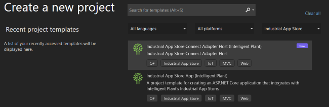

# DataCore.Adapter.Templates

This project defines templates for creating App Store Connect adapters for Visual Studio 2022, Visual Studio 2019, and the [dotnet new](https://docs.microsoft.com/en-us/dotnet/core/tools/dotnet-new) command.

> Templates installed using the `dotnet new` command can be used in Visual Studio 2022 and Visual Studio 2019 (v16.9 or later).


# Installing Templates

You can install the [App Store Connect adapter templates](https://www.nuget.org/packages/IntelligentPlant.AppStoreConnect.Adapter.Templates) for `dotnet new` as follows:

**Latest Version:**

```
dotnet new --install IntelligentPlant.AppStoreConnect.Adapter.Templates
```

> To install a pre-release version, follow the *Specific Version* instructions below.

**Specific Version:**

```
dotnet new --install IntelligentPlant.AppStoreConnect.Adapter.Templates::1.2.3
```

**From Source:**

Alternatively, you can install the template from source by checking out this repository, [building the solution](/build.cake), navigating to the [root templates folder](/src/DataCore.Adapter.Templates) from the command line, and running the following command:

```
dotnet new --install .\
```

# Creating an Adapter and Host using Visual Studio

Once the template package has been installed, search for `Industrial App Store` in Visual Studio's "Create a new project" window or choose `Industrial App Store` from the project types list:



After selecting the "Industrial App Store Connect Adapter Host" template, you will be prompted to select a project location and then optionally enter some details about your adapter that will be applied to the template:


The template will create a new adapter hosted in a minimal API ASP.NET Core application that App Store Connect can connect to using REST API calls or SignalR. The `README.md` file for the new project provides additional information about the adapter.


# Creating an Adapter and Host using `dotnet new`

If you are not using Visual Studio, you can create a new C# project using the `dotnet new` command from the command line as follows:

```
mkdir MyNewAdapter
cd MyNewAdapter
dotnet new aschostedadapter
```

The template will create a new adapter hosted in a minimal API ASP.NET Core application that App Store Connect can connect to using REST API calls or SignalR. The `README.md` file for the new project provides additional information about the adapter.


## Specifying Project Parameters

When creating the project, you can provide command line parameters to pre-populate some project properties. Run `dotnet new aschostedadapter --help` to see all of the available options. 

Examples:

```
# Specifies adapter metadata.

dotnet new aschostedadapter --adapter-name "My MQTT Adapter" --adapter-description "Adapter for MQTT"
```

```
# Specifies vendor metadata.

dotnet new aschostedadapter --vendor-name "Intelligent Plant" --vendor-url "https://www.intelligentplant.com"
```
